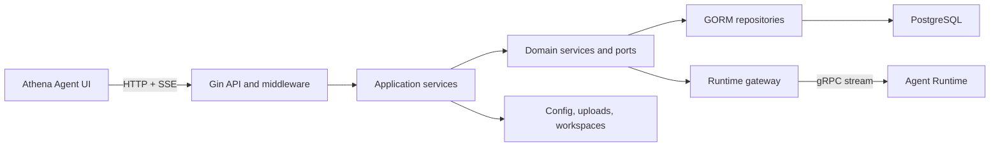

# Athena Agent Runtime Client

[English](README.md) | [简体中文](README.zh-CN.md)

Agent Runtime Client is Athena's control plane and public HTTP API. It manages users, agents, model credentials, model assignments, memories, skills, knowledge bases, workspaces, and service configuration, then forwards execution requests to [`agent-runtime`](https://github.com/good-fish-man/agent-runtime) over gRPC.

Despite its historical name, this is a server application rather than an SDK. Browser clients should call this service and should never call the runtime with model API keys directly.

## Highlights

- Gin HTTP API with authentication, per-user data isolation, and administrator permissions.
- Agent CRUD, public agents, per-user model overrides, sub-agents, skills, and knowledge bases.
- Central model-key vault: update a provider key once without editing every agent.
- LLM, embedding, and image model roles, including local Ollama and Diffusers catalogs.
- Local-model environment detection, download jobs, lifecycle modes, and administrator enable/disable controls.
- Fine-tuning and distillation job APIs with downloadable JSON workflows in the UI.
- Streaming proxy from gRPC to SSE with typed events and trace propagation.
- Project workspace import, tree/search/context, patch generation, validation, and application.
- Automatic database migration and initial shared catalog/agent data.
- Dashboard, memory, channels, callbacks, command execution, service configuration, and restart APIs.
- Source-aware error chains logged once at the HTTP boundary.

## System Architecture



The code follows a DDD-style dependency direction:

```text
api -> application -> domain <- infra
                         ^
                         |
                       boot
```

| Directory | Responsibility |
| --- | --- |
| `api/` | Gin handlers, routes, authentication, trace, CORS, request logging |
| `application/` | Use-case orchestration, DTOs, assemblers |
| `domain/` | Entities, domain services, repository/runtime ports |
| `infra/` | GORM repositories, migrations, gRPC runtime gateway |
| `boot/` | Dependency assembly and process startup |
| `config/` | YAML and environment configuration |
| `pkg/log/` | Structured logging, request IDs, and error chains |

## Requirements

- Go 1.25 or newer.
- A running Agent Runtime at `localhost:18080`.
- PostgreSQL for users and management resources. The service can run without a database as a limited runtime proxy.
- Optional Ollama, Python/Diffusers, Docker, and training dependencies for local model features.

## Quick Start

Start Agent Runtime first, then:

```bash
git clone https://github.com/good-fish-man/agent-runtime-client.git
cd agent-runtime-client
cp manifest/config/config.yaml manifest/config/config.local.yaml
go run . --config manifest/config/config.local.yaml
```

Or use the repository Makefile:

```bash
make run
```

Default endpoints:

| Service | Address |
| --- | --- |
| HTTP API | `http://127.0.0.1:8090` |
| Health | `http://127.0.0.1:8090/healthz` |
| Runtime readiness | `http://127.0.0.1:8090/health/ready` |
| Public API prefix in the sample config | `/api/agent-runtime-client/v1` |

When the database is enabled, migrations run during startup. A development administrator is initialized when absent:

```text
username: athena
password: athena
```

Change this password before exposing the service outside a trusted local environment.

For an automated local installation with managed PostgreSQL, use [`athena-launcher`](https://github.com/good-fish-man/athena-launcher).

## Request Flow

1. The UI authenticates through `/auth/login` and sends its bearer token.
2. Middleware resolves user/admin context and creates or accepts a trace ID.
3. Application services load the selected agent, user-owned model bindings, model key, skills, memories, and knowledge-base settings.
4. The runtime gateway maps the request to protobuf and forwards the same trace ID through gRPC.
5. Streaming responses are translated to SSE without buffering the entire body.
6. Failures are returned with a stable API code and logged with the complete source-aware error chain.

## API Overview

Runtime execution routes are mounted at the root:

| Method | Path | Purpose |
| --- | --- | --- |
| `GET` | `/healthz` | Service health |
| `GET` | `/health/ready` | Runtime connectivity |
| `POST` | `/v1/run` | Rich completion |
| `POST` | `/v1/run/stream` | Rich SSE execution |
| `POST` | `/v1/agent` | Agent execution |
| `POST` | `/v1/agent/stream` | Agent SSE execution |
| `POST` | `/v1/resume` | Resume an interrupted run |
| `POST` | `/v1/stop` | Stop a run |

Management routes are mounted under `server.public_prefix`:

| Group | Capabilities |
| --- | --- |
| `/auth`, `/user` | Login, registration, profile/avatar, administration |
| `/agent` | Agent CRUD, upload, enable/disable, user model assignment |
| `/model`, `/model-key` | Catalog, credentials, local install, lifecycle, training |
| `/memory` | User/agent long-term memory |
| `/skill` | Built-in/custom skill management and ZIP upload |
| `/knowledge_base` | Retrieval configuration and recall testing |
| `/workspace` | Import, tree, search, context, build/apply patch |
| `/dashboard` | Overview, token ranking, activity, recent sessions |
| `/config` | Client/runtime/skills configuration and restart |
| `/channel`, `/callback`, `/weixin`, `/job`, `/command` | Integrations and operational APIs |

All management routes except login, registration, and public avatar retrieval require authentication.

## Configuration

The sample file is [`manifest/config/config.yaml`](manifest/config/config.yaml):

```yaml
server:
  http_addr: ":8090"
  mode: "debug"
  public_prefix: "/api/agent-runtime-client/v1"

runtime:
  grpc_addr: "localhost:18080"
  http_addr: "http://127.0.0.1:18081"

db:
  db_type: "postgres"
  db_host: "127.0.0.1"
  db_port: 5432
  db_name: "agent_runtime"

paths:
  app_config_file: ""
  skills_config_file: ""
  uploads_dir: ""
```

Important environment overrides:

| Variable | Meaning |
| --- | --- |
| `ARC_CONFIG_PATH` | Configuration file path |
| `ARC_HTTP_ADDR`, `ARC_GIN_MODE`, `ARC_PUBLIC_PREFIX` | HTTP service settings |
| `ARC_RUNTIME_GRPC_ADDR`, `ARC_RUNTIME_HTTP_ADDR` | Runtime addresses |
| `ARC_DB_TYPE`, `ARC_DB_HOST`, `ARC_DB_PORT` | Database connection |
| `ARC_DB_USER`, `ARC_DB_PASSWORD`, `ARC_DB_NAME` | Database credentials |

The database is enabled when both `db_host` and `db_name` are non-empty. Keep model provider secrets in model-key records, not in source control or public API responses.

## Development

```bash
make fmt
make test
make vet
make build
```

The binary is written to `deploy/bin/agent-runtime-client` by `make build`.

## Troubleshooting

- `connection refused :18080`: start Agent Runtime or correct `runtime.grpc_addr`.
- `connection refused :11434`: install/start Ollama or change the agent to an available cloud model.
- `please bind a model`: create a user-owned model/key and set it as default or bind it to the agent.
- Database startup failure: verify PostgreSQL, credentials, database existence, and `ssl_mode` expectations.
- Use the response `trace_id` to find the corresponding client and runtime logs.

## Related Projects

- [`agent-runtime`](https://github.com/good-fish-man/agent-runtime): model/tool execution engine.
- [`athena-agent-ui`](https://github.com/good-fish-man/athena-agent-ui): management and chat UI.
- [`athena-launcher`](https://github.com/good-fish-man/athena-launcher): installer and local process manager.

## License

Add a repository license before public redistribution.
