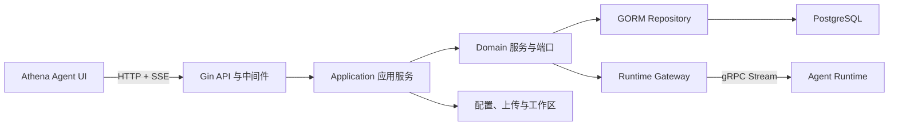

# Athena Agent Runtime Client

[English](README.md) | [简体中文](README.zh-CN.md)

Agent Runtime Client 是 Athena 的控制面和公共 HTTP API。它负责用户、Agent、模型凭据、模型绑定、记忆、Skills、知识库、工作区和服务配置，再通过 gRPC 将执行请求发送给 [`agent-runtime`](https://github.com/good-fish-man/agent-runtime)。

虽然名称中包含 Client，但它实际是服务端程序，不是 SDK。浏览器只应访问本服务，不应直接携带模型 API Key 调用 Runtime。

## 控制面实际效果

登录后的 Dashboard 由本服务的 Agent、任务、Token、审批和会话接口提供数据。模型供应商凭据始终保留在服务端，同时为用户提供统一的运行视图。


## 核心能力

- Gin HTTP API、登录认证、用户数据隔离和管理员权限。
- Agent CRUD、公共 Agent、用户模型覆盖、Sub-Agents、Skills 与知识库。
- 集中的模型 Key 管理：更换供应商 Key 时不需要逐个修改 Agent。
- LLM、Embedding 和图片模型角色，包括本地 Ollama 与 Diffusers 模型目录。
- 本地模型环境检测、下载任务、生命周期模式和管理员启停控制。
- 微调与蒸馏任务接口，前端支持下载 JSON 模板。
- 将 gRPC Stream 转换为 SSE，并传递类型化事件与 Trace ID。
- 项目目录导入、文件树、搜索、上下文、补丁生成/校验/应用。
- 启动时自动迁移数据库，并初始化公共目录与 Agent 数据。
- Dashboard、记忆、渠道、回调、命令执行、服务配置与重启接口。
- 带源码位置的错误链，并只在 HTTP 边界集中输出一次。
- 面向桌面设备的 WebSocket Action/Observation 控制面与能力协商（[协议文档](docs/action-observation-protocol.md)）。
- 经过脱敏的任务经验、用户级保留/删除控制、失败分类与确定性离线评测（[架构文档](docs/experience-evaluation.zh-CN.md)）。

## 系统架构



代码采用 DDD 风格的依赖方向：

```text
api -> application -> domain <- infra
                         ^
                         |
                       boot
```

| 目录 | 职责 |
| --- | --- |
| `api/` | Gin Handler、路由、认证、Trace、CORS 和请求日志 |
| `application/` | 用例编排、DTO、Assembler |
| `domain/` | Entity、领域服务、Repository/Runtime 端口 |
| `infra/` | GORM Repository、数据库迁移、gRPC Runtime Gateway |
| `boot/` | 依赖装配和进程启动 |
| `config/` | YAML 与环境变量配置 |
| `github.com/good-fish-man/logx` | 共享结构化日志、请求 ID 与错误链 |

## 环境要求

- Go 1.25 或更高版本。
- `localhost:18080` 上已运行 Agent Runtime。
- 用户和管理资源需要 PostgreSQL；没有数据库时只能作为功能受限的 Runtime 代理运行。
- 本地模型功能可能需要 Ollama、Python/Diffusers、Docker 或训练环境。

## 快速开始

先启动 Agent Runtime，然后执行：

```bash
git clone https://github.com/good-fish-man/agent-runtime-client.git
cd agent-runtime-client
cp manifest/config/config.yaml manifest/config/config.local.yaml
go run . --config manifest/config/config.local.yaml
```

也可使用仓库 Makefile：

```bash
make run
```

默认地址：

| 服务 | 地址 |
| --- | --- |
| HTTP API | `http://127.0.0.1:8090` |
| 健康检查 | `http://127.0.0.1:8090/healthz` |
| Runtime 就绪检查 | `http://127.0.0.1:8090/health/ready` |
| 示例配置的公共 API 前缀 | `/api/agent-runtime-client/v1` |

启用数据库后，服务会在启动时执行迁移。如果管理员不存在，会初始化开发管理员：

```text
账号：athena
密码：athena
```

如果服务不只在可信本机环境中使用，请立即修改默认密码。
该账号仅在不存在时初始化；重启服务不会重复创建账号，也不会把已修改的密码重置为默认值。

需要自动安装并管理 PostgreSQL 时，请使用 [`athena-launcher`](https://github.com/good-fish-man/athena-launcher)。

## 请求流程

1. 前端通过 `/auth/login` 登录，并在后续请求携带 Bearer Token。
2. 中间件解析用户/管理员上下文，接收或创建 Trace ID。
3. 应用服务加载 Agent、用户模型绑定、模型 Key、Skills、记忆与知识库配置。
4. Runtime Gateway 转换为 protobuf，并通过 gRPC 继续传递相同 Trace ID。
5. 流式响应转换为 SSE，不缓存完整响应体。
6. 错误以稳定 API Code 返回，并在日志中输出带源码位置的完整错误链。

## API 概览

Runtime 执行接口位于根路径：

| 方法 | 路径 | 用途 |
| --- | --- | --- |
| `GET` | `/healthz` | 服务健康检查 |
| `GET` | `/health/ready` | Runtime 连接检查 |
| `GET` | `/v1/capabilities` | Runtime 能力注册目录 |
| `POST` | `/v1/run` | 完整执行 |
| `POST` | `/v1/run/stream` | SSE 流式执行 |
| `POST` | `/v1/agent` | Agent 执行 |
| `POST` | `/v1/agent/stream` | Agent SSE 执行 |
| `POST` | `/v1/resume` | 恢复中断任务 |
| `POST` | `/v1/stop` | 停止任务 |

管理接口挂载在 `server.public_prefix` 下：

| 分组 | 能力 |
| --- | --- |
| `/auth`、`/user` | 登录、注册、资料/头像和用户管理 |
| `/agent` | Agent CRUD、上传、启停、用户模型绑定 |
| `/model`、`/model-key` | 模型目录、凭据、本地安装、生命周期和训练 |
| `/site-credential` | 当前用户的网站账号元数据与 Auth Vault 辅助登录 |
| `/scheduled-task` | 用户隔离的持久化监控任务、执行记录与结果复核 |
| `/goals` | 有界长期 Goal、Specialist 任务、Checkpoint、暂停与恢复 |
| `/experience`、`/evaluation` | 脱敏历史证据、保留控制与离线回归套件 |
| `/memory` | 用户/Agent 长期记忆 |
| `/skill` | 内置/自定义 Skill 管理与 ZIP 上传 |
| `/knowledge_base` | 检索配置与召回测试 |
| `/workspace` | 导入、文件树、搜索、上下文、生成/应用补丁 |
| `/dashboard` | 概览、Token 排名、渠道活动和最近会话 |
| `/config` | Client/Runtime/Skills 配置与重启 |
| `/channel`、`/callback`、`/weixin`、`/job`、`/command` | 集成和运维接口 |

除登录、注册和公开头像读取外，管理接口都需要认证。

## 配置

示例配置位于 [`manifest/config/config.yaml`](manifest/config/config.yaml)：

```yaml
server:
  http_addr: ":8090"
  mode: "debug"
  public_prefix: "/api/agent-runtime-client/v1"

runtime:
  grpc_addr: "localhost:18080"
  http_addr: "http://127.0.0.1:18081"

db:
  db_type: "postgres"
  db_host: "127.0.0.1"
  db_port: 5432
  db_name: "agent_runtime"

paths:
  app_config_file: ""
  skills_config_file: ""
  uploads_dir: ""
```

常用环境变量：

| 变量 | 说明 |
| --- | --- |
| `ARC_CONFIG_PATH` | 配置文件路径 |
| `ARC_HTTP_ADDR`、`ARC_GIN_MODE`、`ARC_PUBLIC_PREFIX` | HTTP 服务配置 |
| `ARC_RUNTIME_GRPC_ADDR`、`ARC_RUNTIME_HTTP_ADDR` | Runtime 地址 |
| `ARC_DB_TYPE`、`ARC_DB_HOST`、`ARC_DB_PORT` | 数据库连接 |
| `ARC_DB_USER`、`ARC_DB_PASSWORD`、`ARC_DB_NAME` | 数据库凭据 |
| `ARC_SCHEDULED_TASK_SCAN_INTERVAL_SEC` | 定时任务扫描数据库的间隔，默认 `60` 秒 |
| `ARC_ORCHESTRATION_ENABLED` | 是否启用持久化 Goal Supervisor |
| `ARC_ORCHESTRATION_SCAN_INTERVAL_SEC` | Goal Supervisor 扫描间隔，默认 `3` 秒 |
| `ARC_ORCHESTRATION_MAX_CONCURRENT_RUNS` | 全局 Specialist 并发上限，默认 `2` |
| `ATHENA_INTERNAL_SERVICE_TOKEN` | 内部定时任务接口校验的本机共享令牌 |
| `ATHENA_DEVICE_TOKEN` | 桌面 Action/Observation WebSocket 使用的 Bearer Token |

`db_host` 和 `db_name` 都不为空时启用数据库。模型供应商密钥应保存到模型 Key 表，不应提交到源码或在公共 API 中返回。

执行、恢复、安全边界与回滚说明见
[持久化 Goal 与 Supervisor v0.7](docs/durable-goals-v0.7.zh-CN.md)。

## 开发

```bash
make fmt
make test
make vet
make build
```

`make build` 会生成 `deploy/bin/agent-runtime-client`。

## 常见问题

- `connection refused :18080`：启动 Agent Runtime，或修正 `runtime.grpc_addr`。
- `connection refused :11434`：安装并启动 Ollama，或将 Agent 切换到可用云端模型。
- “请先绑定模型”：创建当前用户的模型/Key，并设为默认模型或主动绑定到 Agent。
- 数据库启动失败：检查 PostgreSQL、账号密码、数据库是否存在及 SSL 配置。
- 使用响应中的 `trace_id`，可在 Client 和 Runtime 日志中定位同一次请求。

## 相关项目

- [`agent-runtime`](https://github.com/good-fish-man/agent-runtime)：模型与工具执行引擎。
- [`athena-agent-ui`](https://github.com/good-fish-man/athena-agent-ui)：管理与聊天前端。
- [`athena-launcher`](https://github.com/good-fish-man/athena-launcher)：安装器与本地进程管理器。

## 许可证

Athena Agent Runtime Client 使用 [Apache License 2.0](LICENSE)。版权和依赖说明参见 [NOTICE](NOTICE) 与 [THIRD_PARTY_NOTICES.md](THIRD_PARTY_NOTICES.md)。
