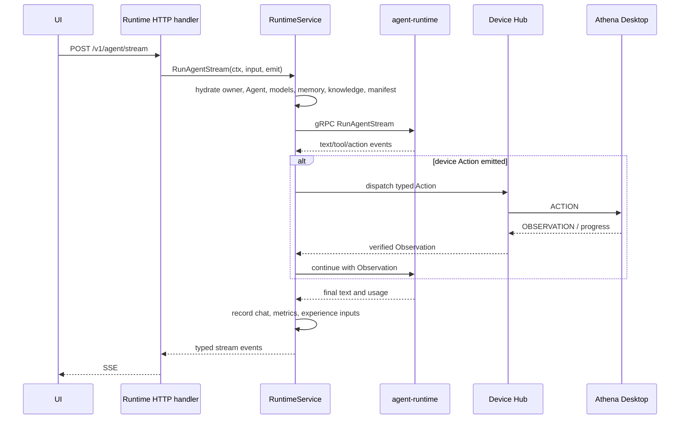

# 04. Runtime Execution, Streaming, and Device Control

[Guide index](README.md) | [简体中文](../zh-CN/04-runtime-execution-and-device-control.md)

## Purpose

This is the main online execution path. It turns an authenticated request into a fully hydrated Runtime call, streams visible events to the user, executes device Actions when required, feeds Observations back to Runtime, and records the final outcome.

## End-to-End Flow

## Application Runtime Service

[`application/service/runtime/service.go`](../../../application/service/runtime/service.go) is the use-case coordinator. Before calling Runtime, it may:

- resolve the authenticated user and control/device context;
- load the selected Agent or public Agent template;
- resolve explicit Agent models or the user's default LLM fallback;
- ensure an embedding model is used only for embedding work;
- load provider credentials from the user's model-key record;
- attach Skills, knowledge bases, memories, files, visual inputs, and sub-Agent declarations;
- resolve approved immutable deployment artifacts;
- attach a `RunManifest` for provenance; and
- forward the trace ID.

This hydration is server-side. The UI should not receive prompts or API keys and send them back.

## Runtime Domain Port and gRPC Adapter

[`domain/irepository/runtime`](../../../domain/irepository/runtime) defines the Runtime port. [`domain/srv/runtime`](../../../domain/srv/runtime) exposes it to application code without importing protobuf types.

[`infra/runtime`](../../../infra/runtime) implements the port:

- `client.go` owns the gRPC connection and generated client;
- `gateway.go` sets timeouts/trace metadata and calls RPCs;
- `mapping_request.go` converts domain input to protobuf;
- `mapping_response.go` converts unary responses; and
- `mapping_stream.go` converts typed stream events.

Unary calls use a configured timeout. Streams inherit the caller's context and intentionally do not use the short unary deadline.

## Stream Semantics

A stream may include:

- visible assistant text;
- reasoning/progress metadata;
- tool-call fragments;
- Action requests;
- device progress and Observations;
- usage and finish metadata; and
- one terminal success, failure, cancellation, or waiting state.

Protocol-only chunks are not user-visible assistant content. A tool-call finish with no text is not a successful final answer: the tool/Action chain must execute and Runtime must continue until it emits a visible or explicit terminal result.

## Device Action/Observation Loop

The Runtime service runs a bounded continuation loop when Runtime requests a desktop/browser capability:

1. capture and validate the pending typed Action;
2. resolve an online device owned by the user with the required capability;
3. apply policy/approval requirements;
4. dispatch through the control Hub using a stable action/idempotency identity;
5. wait for progress, cancellation, timeout, or an Observation;
6. verify that the Observation belongs to the current action/session/lease;
7. add evidence and visual inputs to the next Runtime context; and
8. continue the same logical run.

The loop is bounded to prevent an Agent from executing forever. Waiting for approval or the user is a first-class outcome, not a transport failure.

## Control Hub

[`application/service/control/hub.go`](../../../application/service/control/hub.go) owns live device connections and durable coordination. It handles:

- registration and user binding;
- reported capability snapshots;
- heartbeats, online state, and lease expiration;
- exclusive leases and fencing tokens;
- action dispatch and observation correlation;
- progress events and cancellation propagation;
- duplicate request/terminal-event suppression;
- approval and human-intervention states;
- restart recovery for pending work;
- outbox/event persistence; and
- device diagnostics.

The durable interfaces and protocol entities live in [`domain/irepository/control`](../../../domain/irepository/control) and [`domain/entity/control`](../../../domain/entity/control). PostgreSQL implementation lives in [`infra/repository/repo/control`](../../../infra/repository/repo/control).

## Device Resolution

Resolution must fail closed:

- an explicit device ID must belong to the user;
- an implicit choice requires a currently leased/online compatible device;
- ambiguous compatible devices require an explicit choice;
- expired heartbeats do not count as online; and
- capability names and versions must match the Action requirements.

`online=true` in one row is not sufficient if the lease expired or a different service instance owns the connection.

## Observation and Effect Semantics

[`application/service/runtime/effect_semantics.go`](../../../application/service/runtime/effect_semantics.go) prevents transport success from being mistaken for real-world success. A completed device message must include evidence that the requested effect occurred, or explicitly report unknown/failed state.

For browser/desktop operations, an Observation may include URL, title, active window, UI facts, screenshot references, changed state, warnings, and structured verification. Visual data is attached through [`control_visual_input.go`](../../../application/service/runtime/control_visual_input.go), not flattened into an unbounded prompt.

## Chat and Usage Recording

[`application/service/runtime/chat_recorder.go`](../../../application/service/runtime/chat_recorder.go) records owner-scoped sessions, messages, token statistics, and model usage metrics. It is also the source for model-management 24-hour usage, latency, token, and success displays.

Recording failure should be observable, but it must not convert an already completed model answer into a false execution failure unless durability is a declared requirement of that operation.

## Media Generation

Runtime routes support synchronous generation and durable media jobs. Image/video work may outlive normal request timeouts, so provider jobs are persisted through `domain/entity/runtime`, the Runtime service, and `infra/repository/po/runtime`.

Media jobs are owner-scoped. Long-running progress should survive page navigation and be queryable after reconnect.

## Debugging an Empty or Stuck Response

Follow one trace ID through:

1. HTTP handler received request.
2. RuntimeService completed hydration and selected the expected model.
3. gRPC stream opened.
4. stream mapping received text, tool calls, or Action events.
5. if Action: device resolution selected a live compatible device.
6. Hub persisted/dispatched the Action.
7. device returned a correlated Observation.
8. Runtime continuation received that Observation.
9. one final visible/terminal event reached SSE.
10. chat/usage recording ran after completion.

If the model stopped with `tool_calls`, inspect tool-call assembly rather than treating empty `Content` as the root cause.

## Read These Files First

| File | Purpose |
| --- | --- |
| [`application/service/runtime/service.go`](../../../application/service/runtime/service.go) | complete execution coordinator |
| [`application/service/runtime/chat_recorder.go`](../../../application/service/runtime/chat_recorder.go) | conversation and usage persistence |
| [`application/service/runtime/effect_semantics.go`](../../../application/service/runtime/effect_semantics.go) | real-effect verification |
| [`domain/irepository/runtime/gateway.go`](../../../domain/irepository/runtime/gateway.go) | Runtime port |
| [`infra/runtime/gateway.go`](../../../infra/runtime/gateway.go) | gRPC implementation and trace propagation |
| [`application/service/control/hub.go`](../../../application/service/control/hub.go) | live/durable device coordination |
| [`docs/action-observation-protocol.md`](../../action-observation-protocol.md) | protocol contract |

## Change Checklist

- Does hydration keep credentials server-side and owner-scoped?
- Is every event associated with the same trace/run/task identities?
- Can cancellation reach the model, tool, device, and continuation loop?
- Is device success supported by an Observation and effect evidence?
- Are duplicate Actions and terminal messages idempotent?
- Does the stream always reach one meaningful terminal state?
