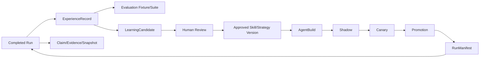

# 06. Experience, Learning, Deployment, and Knowledge

[Guide index](README.md) | [简体中文](../zh-CN/06-experience-learning-deployment-and-knowledge.md)

## Purpose

These subsystems turn completed work into governed evidence and improvements. They are deliberately separated so online execution cannot immediately rewrite its own production behavior.

## Experience Capture

[`application/service/experience`](../../../application/service/experience) converts terminal task evidence into owner-scoped Experience records. An Experience describes what happened, which artifacts/actions/observations were involved, the outcome, and any failure classification.

Before persistence, the service:

- removes credentials and sensitive content;
- applies user retention preferences;
- classifies failures;
- records immutable event/evidence references;
- optionally creates retrieval vectors; and
- preserves provenance without exposing raw private payloads.

Users can list, search, export, and delete their own Experience data.

## Deterministic Evaluation

Evaluation fixtures are explicit snapshots derived from approved Experience evidence. Suites contain fixtures, runs record one execution, and results retain per-fixture evidence and outcome.

Offline evaluation is used to compare candidates/builds without promoting them. It must be deterministic enough to identify regressions and must not claim that a mocked browser test proves a real browser effect.

See [`docs/experience-evaluation.md`](../../experience-evaluation.md) for the dedicated model.

## Learning Candidates

[`application/service/learning`](../../../application/service/learning) owns declarative Skill and Strategy candidates. The lifecycle includes generation, evidence attachment, evaluation, editing, human review, and approved version creation.

Critical boundary: generated code is not directly executed. A candidate is data until governance creates an approved immutable artifact.

## Demonstration Learning

[`demonstration.go`](../../../application/service/learning/demonstration.go) records a user's demonstrated semantic steps. Each step must reference an available registered capability/operation. Sensitive input pauses recording or is redacted, and direct executor payloads are rejected.

The user can preview/edit and must explicitly confirm the demonstration. Confirmation binds the current actor and capability availability.

## Evolution Orchestrator

[`evolution.go`](../../../application/service/learning/evolution.go) is a background proposal engine. It scans eligible owner-scoped Experiences, detects repeated patterns, and proposes deterministic private Skill candidates when evidence thresholds are met.

It does **not** auto-promote. The intended chain is:

```text
Experience[] -> pattern aggregation -> LearningCandidate
             -> offline evaluation -> review -> deployment stages
```

Idempotent candidate identities prevent repeated scans from creating duplicates.

## Deployment and Runtime Artifacts

[`application/service/deployment`](../../../application/service/deployment) governs immutable `AgentBuild` artifacts and their release lifecycle:

- create content-addressed builds from approved versions;
- resolve exact artifact versions;
- run shadow evaluation;
- expose low-risk canaries;
- collect samples and metrics;
- promote one active build; and
- roll back with an audit/compensation record.

A `RunManifest` records the exact build, Skills, Strategies, policy, and relevant identities used by one execution. This makes replay and Experience evidence meaningful.

World/policy changes invalidate stale approvals rather than mutating the old decision.

## Plugin Registry

[`application/service/pluginregistry`](../../../application/service/pluginregistry) manages signed Capability Provider packages. Installation verifies the exact package, manifest, signature, assets, and SBOM. Activation additionally requires trusted scan evidence, explicit permissions, and human review where policy requires it.

Versions are immutable. Tampered packages are quarantined; revocation is terminal. Runtime reload and every provider invocation are auditable.

Plugins extend capabilities, but they do not bypass Action policy, user ownership, or artifact governance.

## Evidence Knowledge

[`application/service/knowledge`](../../../application/service/knowledge) manages claims, evidence, contradictions, snapshots, retrieval, and controlled ontology evolution.

The important distinction is:

- **knowledge base resource**: user-managed documents/configuration used by an Agent;
- **evidence knowledge**: structured claims with source, confidence, temporal validity, contradiction state, and run bindings.

Retrieval ranks evidence without erasing disagreement. Contradictions remain first-class until resolved with evidence. Snapshots bind a run to the knowledge state it actually observed.

Ontology changes use versioned packs, candidates, review, and explicit migrations. Runtime cannot silently rewrite the shared ontology.

## Data Relationships



## Read These Files First

| Area | Starting point |
| --- | --- |
| Experience | [`application/service/experience/service.go`](../../../application/service/experience/service.go) |
| Evaluation | [`application/service/experience/evaluation.go`](../../../application/service/experience/evaluation.go) |
| Learning | [`application/service/learning/service.go`](../../../application/service/learning/service.go) |
| Evolution | [`application/service/learning/evolution.go`](../../../application/service/learning/evolution.go) |
| Deployment | [`application/service/deployment/service.go`](../../../application/service/deployment/service.go) |
| Artifact resolution | [`application/service/deployment/delegation_artifacts.go`](../../../application/service/deployment/delegation_artifacts.go) |
| Plugin registry | [`application/service/pluginregistry/service.go`](../../../application/service/pluginregistry/service.go) |
| Evidence knowledge | [`application/service/knowledge/service.go`](../../../application/service/knowledge/service.go) |
| Knowledge engines | [`application/service/knowledge/engines.go`](../../../application/service/knowledge/engines.go) |

## Change Checklist

- Is raw sensitive content removed before Experience persistence?
- Is online evidence immutable and learning performed in a separate stage?
- Can a candidate execute only after evaluation/review/build resolution?
- Does each run record exact artifact versions in a manifest?
- Are shadow, canary, promotion, and rollback distinguishable states?
- Does knowledge preserve source, time, confidence, and contradictions?
