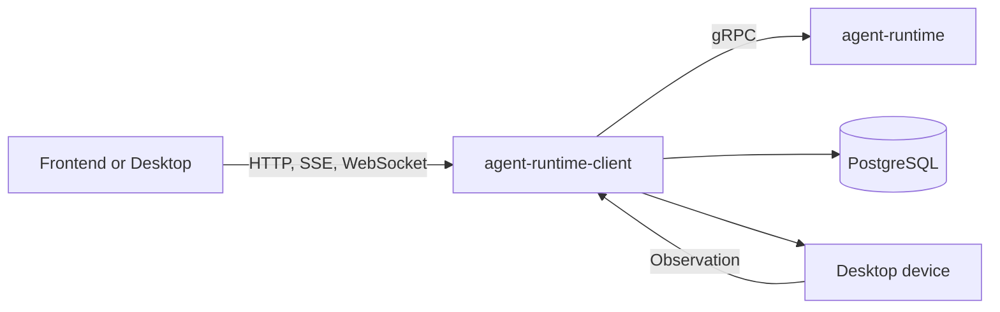

# Agent Runtime Client Code Guide

[English](README.md) | [简体中文](../zh-CN/README.md)

This guide explains the purpose of every major part of `agent-runtime-client` and gives a practical reading order for the code. It is written for contributors who need to understand the system before changing it.

## What This Repository Is

Despite its historical name, `agent-runtime-client` is not a client SDK. It is Athena's server-side control plane and public HTTP API. It owns identity, configuration, durable state, governance, device coordination, and the boundary to `agent-runtime`.



The shortest useful mental model is:

- `api`: translate transport requests into use cases.
- `application`: coordinate complete use cases.
- `domain`: define business meaning and dependency ports.
- `infra`: implement ports with PostgreSQL, gRPC, files, and external processes.
- `boot`: construct the object graph and own background-service lifetimes.

## Recommended Reading Paths

### New contributor

1. [Architecture, startup, and configuration](01-architecture-startup-and-configuration.md)
2. [HTTP API, identity, and security](02-http-api-identity-and-security.md)
3. [Resources, domain model, and persistence](03-resources-domain-and-persistence.md)
4. [Runtime execution, streaming, and device control](04-runtime-execution-and-device-control.md)
5. Use the [package reference](package-reference.md) when following imports.

### Runtime request debugging

1. Start at `api/http/handler/runtime`.
2. Continue through `application/service/runtime`.
3. Inspect `domain/srv/runtime` and `domain/irepository/runtime`.
4. Finish at `infra/runtime` and the gRPC stream mapping.
5. If an Action is emitted, continue through `application/service/control`.

### Control-plane feature development

1. Read [Resources, domain model, and persistence](03-resources-domain-and-persistence.md).
2. Find the resource's handler, DTO, assembler, service, entity, port, PO, converter, and repository.
3. Use one existing resource as the vertical-slice template.

### Governed Agent OS development

1. [Delegation, goals, and scheduling](05-delegation-goals-and-scheduling.md)
2. [Experience, learning, deployment, and knowledge](06-experience-learning-deployment-and-knowledge.md)
3. [Operations, workspaces, and integrations](07-operations-workspaces-and-integrations.md)
4. [Testing and extension guide](08-testing-and-extension-guide.md)

## Chapter Index

| Chapter | Purpose |
| --- | --- |
| [01](01-architecture-startup-and-configuration.md) | Process lifecycle, dependency direction, configuration, and boot composition |
| [02](02-http-api-identity-and-security.md) | Gin routes, middleware, authentication, error responses, SSE, and WebSocket boundaries |
| [03](03-resources-domain-and-persistence.md) | CRUD resources, DDD layers, model/key isolation, repositories, and migrations |
| [04](04-runtime-execution-and-device-control.md) | Runtime request hydration, gRPC streaming, Action/Observation loops, chat recording, and media jobs |
| [05](05-delegation-goals-and-scheduling.md) | Durable delegation, dynamic specialists, long-running goals, checkpoints, and scheduled work |
| [06](06-experience-learning-deployment-and-knowledge.md) | Sanitized experience, evaluation, governed evolution, immutable builds, and evidence knowledge |
| [07](07-operations-workspaces-and-integrations.md) | Readiness, backup/recovery, local workspaces, configuration, channels, callbacks, and external adapters |
| [08](08-testing-and-extension-guide.md) | Test strategy, adding features safely, debugging paths, and architectural guardrails |
| [Packages](package-reference.md) | Purpose of every Go package directory in the repository |

## Dependency Rule

The intended compile-time dependency direction is:

```text
api -> application -> domain <- infra
                         ^
                         |
                        boot
```

`domain` must not import Gin, GORM, generated gRPC clients, or operating-system adapters. `boot` is allowed to know every concrete implementation because it is the composition root.

## Vocabulary

| Term | Meaning in this repository |
| --- | --- |
| Runtime Client | This control-plane service, not a user SDK |
| Runtime | The separate `agent-runtime` execution engine |
| Action | A typed request for a device capability to change the world |
| Observation | Evidence returned by a device after an Action |
| Experience | Sanitized, immutable evidence derived from a completed task |
| Candidate | A proposal that cannot execute until evaluation and governance allow it |
| Build | An immutable bundle of approved runtime artifacts |
| RunManifest | Exact artifact and policy identities attached to one execution |
| Goal | A durable task graph that may survive process and frontend restarts |

## Keeping This Guide Current

When adding a new top-level package or a new application subsystem:

1. Add it to [the package reference](package-reference.md).
2. Update the matching subsystem chapter in both languages.
3. Describe ownership and invariants, not only endpoint names.
4. Link to existing protocol/design documents instead of duplicating their full schemas.
