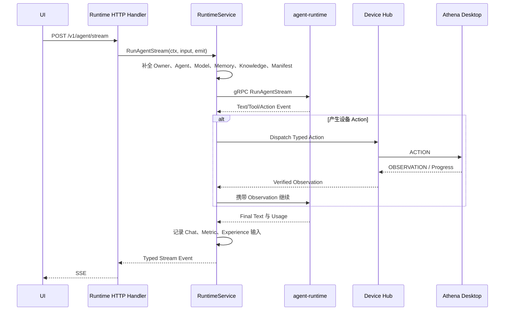

# 04. Runtime 执行、流式响应与设备控制

[指南首页](README.md) | [English](../en/04-runtime-execution-and-device-control.md)

## 目的

这是主要在线执行路径。它把认证请求转换为补全后的 Runtime 调用，将可见 Event 流式返回用户，在需要时执行设备 Action，把 Observation 重新送回 Runtime，并记录最终结果。

## 端到端流程

## Application Runtime Service

[`application/service/runtime/service.go`](../../../application/service/runtime/service.go) 是用例编排器。调用 Runtime 前，它可能执行：

- 解析认证用户与 Control/Device Context；
- 加载选择的 Agent 或公共 Agent 模板；
- 解析 Agent 显式 Model，或回退到用户默认 LLM；
- 确保 Embedding Model 只用于 Embedding 工作；
- 从用户 Model Key Record 加载 Provider Credential；
- 附加 Skill、Knowledge Base、Memory、File、Visual Input 与 Sub-Agent 声明；
- 解析批准后的不可变 Deployment Artifact；
- 附加用于 Provenance 的 `RunManifest`；
- 转发 Trace ID。

这些补全发生在服务端。UI 不应接收 Prompt 或 API Key 再传回来。

## Runtime Domain Port 与 gRPC Adapter

[`domain/irepository/runtime`](../../../domain/irepository/runtime) 定义 Runtime Port；[`domain/srv/runtime`](../../../domain/srv/runtime) 使 Application Code 无需 import Protobuf 类型。

[`infra/runtime`](../../../infra/runtime) 实现该 Port：

- `client.go` 管理 gRPC Connection 与生成 Client；
- `gateway.go` 设置 Timeout/Trace Metadata 并调用 RPC；
- `mapping_request.go` 将 Domain Input 转为 Protobuf；
- `mapping_response.go` 转换 Unary Response；
- `mapping_stream.go` 转换类型化 Stream Event。

Unary Call 使用配置超时；Stream 继承调用方 Context，不使用较短的 Unary Deadline。

## Stream 语义

Stream 可能包含：

- 用户可见 Assistant Text；
- Reasoning/Progress Metadata；
- Tool Call Fragment；
- Action Request；
- Device Progress 与 Observation；
- Usage 和 Finish Metadata；
- 唯一的成功、失败、取消或等待终态。

协议内部 Chunk 不属于用户可见 Assistant Content。只有 Tool Call、没有 Text 的 Finish 并不是最终成功；系统必须执行 Tool/Action 链并让 Runtime 继续，直到产生可见结果或显式终态。

## 设备 Action/Observation 循环

Runtime 请求桌面/浏览器能力时，Runtime Service 执行有界 Continuation Loop：

1. 捕获并验证 Pending Typed Action；
2. 选择属于用户且具备所需 Capability 的在线设备；
3. 应用 Policy 和 Approval；
4. 通过 Control Hub 使用稳定 Action/Idempotency ID 下发；
5. 等待 Progress、Cancel、Timeout 或 Observation；
6. 验证 Observation 属于当前 Action、Session 与 Lease；
7. 将 Evidence 和 Visual Input 加入下一轮 Runtime Context；
8. 继续同一个逻辑 Run。

循环有最大次数，防止 Agent 无限执行。等待审批或用户是第一类 Outcome，不是 Transport Error。

## Control Hub

[`application/service/control/hub.go`](../../../application/service/control/hub.go) 管理实时设备连接与持久协调，包括：

- 注册与 User Binding；
- Capability Snapshot 上报；
- Heartbeat、Online State 与 Lease Expiry；
- Exclusive Lease 与 Fencing Token；
- Action Dispatch 与 Observation Correlation；
- Progress Event 与 Cancellation Propagation；
- 重复请求/终态 Event 抑制；
- Approval 与 Human Intervention；
- Pending Work 的重启恢复；
- Outbox/Event 持久化；
- Device Diagnostics。

持久接口与协议 Entity 位于 [`domain/irepository/control`](../../../domain/irepository/control) 和 [`domain/entity/control`](../../../domain/entity/control)，PostgreSQL 实现位于 [`infra/repository/repo/control`](../../../infra/repository/repo/control)。

## 设备解析

解析必须 Fail Closed：

- 显式 Device ID 必须属于当前用户；
- 隐式选择必须找到当前 Lease/Online 且兼容的设备；
- 多个兼容设备产生歧义时要求显式选择；
- Heartbeat 过期的设备不算在线；
- Capability 名称和版本必须符合 Action 要求。

数据库一行 `online=true` 并不充分，Lease 可能已过期，或连接属于另一个服务实例。

## Observation 与 Effect 语义

[`application/service/runtime/effect_semantics.go`](../../../application/service/runtime/effect_semantics.go) 防止把 Transport Success 误认为真实世界成功。Device Message 完成时必须有请求 Effect 已发生的证据，或明确报告 Unknown/Failed。

Browser/Desktop Observation 可以包含 URL、Title、Active Window、UI Fact、Screenshot Reference、State Change、Warning 与 Structured Verification。Visual Data 通过 [`control_visual_input.go`](../../../application/service/runtime/control_visual_input.go) 以引用形式附加，不能把无界页面内容直接塞入 Prompt。

## Chat 与 Usage 记录

[`application/service/runtime/chat_recorder.go`](../../../application/service/runtime/chat_recorder.go) 记录 Owner-Scoped Session、Message、Token Statistic 与 Model Usage Metric。Model Management 页面最近 24 小时 Usage、Latency、Token 与 Success 数据来自这里。

记录失败应可观察，但除非该操作明确要求强持久性，否则不能把已经完成的模型答案改成虚假执行失败。

## Media Generation

Runtime Route 支持同步生成和持久 Media Job。图片尤其是视频可能超过普通请求超时，因此 Provider Job 会通过 `domain/entity/runtime`、Runtime Service 与 `infra/repository/po/runtime` 持久化。

Media Job 按 Owner 隔离；长任务进度应跨页面导航保存，并能在重连后查询。

## 排查空响应或卡住

使用同一个 Trace ID 检查：

1. HTTP Handler 收到请求。
2. RuntimeService 完成补全并选择了预期 Model。
3. gRPC Stream 成功打开。
4. Stream Mapping 收到 Text、Tool Call 或 Action Event。
5. 如果是 Action，Device Resolution 找到在线兼容设备。
6. Hub 持久化并下发 Action。
7. Device 返回相关联 Observation。
8. Runtime Continuation 收到 Observation。
9. 一个最终可见/终态 Event 到达 SSE。
10. 完成 Chat/Usage Record。

如果 Model 以 `tool_calls` 结束，应检查 Tool Call Assembly，而不是把空 `Content` 当成根因。

## 优先阅读文件

| 文件 | 用途 |
| --- | --- |
| [`application/service/runtime/service.go`](../../../application/service/runtime/service.go) | 完整执行编排 |
| [`application/service/runtime/chat_recorder.go`](../../../application/service/runtime/chat_recorder.go) | 会话与 Usage 持久化 |
| [`application/service/runtime/effect_semantics.go`](../../../application/service/runtime/effect_semantics.go) | 真实 Effect 验证 |
| [`domain/irepository/runtime/gateway.go`](../../../domain/irepository/runtime/gateway.go) | Runtime Port |
| [`infra/runtime/gateway.go`](../../../infra/runtime/gateway.go) | gRPC 实现与 Trace 传播 |
| [`application/service/control/hub.go`](../../../application/service/control/hub.go) | 实时/持久设备协调 |
| [`docs/action-observation-protocol.md`](../../action-observation-protocol.md) | 协议契约 |

## 修改检查清单

- 补全是否保持 Credential 在服务端并按 Owner 隔离？
- 每个 Event 是否关联同一 Trace/Run/Task Identity？
- Cancel 是否能到达 Model、Tool、Device 与 Continuation Loop？
- 设备成功是否有 Observation 和 Effect Evidence 支持？
- 重复 Action 与 Terminal Message 是否幂等？
- Stream 是否总能进入一个有意义终态？
