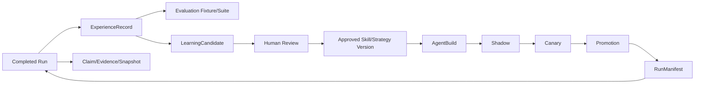

# 06. 经验、学习、部署与知识

[指南首页](README.md) | [English](../en/06-experience-learning-deployment-and-knowledge.md)

## 目的

这些子系统把已完成工作转换为受治理 Evidence 与 Improvement。它们刻意分离，防止在线执行立即改写自己的生产行为。

## Experience 捕获

[`application/service/experience`](../../../application/service/experience) 将 Terminal Task Evidence 转换为 Owner-Scoped Experience。Experience 描述发生了什么、涉及哪些 Artifact/Action/Observation、结果如何以及 Failure Classification。

持久化之前，Service 会：

- 移除 Credential 与敏感 Content；
- 应用用户 Retention Preference；
- 分类 Failure；
- 记录不可变 Event/Evidence Reference；
- 可选生成 Retrieval Vector；
- 保留 Provenance，但不暴露原始私有 Payload。

用户可以 List、Search、Export 和 Delete 自己的 Experience。

## 确定性评测

Evaluation Fixture 是从已批准 Experience Evidence 创建的显式 Snapshot；Suite 包含 Fixture；Run 表示一次执行；Result 保存每个 Fixture 的 Evidence 与 Outcome。

Offline Evaluation 用于在 Promotion 前比较 Candidate/Build。它必须足够确定以识别回归，也不能把 Mock Browser Test 声称成真实 Browser Effect。

专用模型见 [`docs/experience-evaluation.zh-CN.md`](../../experience-evaluation.zh-CN.md)。

## Learning Candidate

[`application/service/learning`](../../../application/service/learning) 管理声明式 Skill 和 Strategy Candidate，生命周期包括生成、附加 Evidence、Evaluation、Edit、Human Review 与创建批准版本。

关键边界：生成代码不能直接执行。Candidate 在治理创建已批准不可变 Artifact 之前只是数据。

## Demonstration Learning

[`demonstration.go`](../../../application/service/learning/demonstration.go) 记录用户演示的 Semantic Step。每一步必须引用当前可用的 Registered Capability/Operation。敏感输入会暂停记录或脱敏，Direct Executor Payload 会被拒绝。

用户可以 Preview/Edit，并必须显式 Confirm；Confirm 会绑定当前 Actor 和 Capability Availability。

## Evolution Orchestrator

[`evolution.go`](../../../application/service/learning/evolution.go) 是后台 Proposal Engine。它扫描符合条件的 Owner-Scoped Experience、识别重复 Pattern，并在 Evidence Threshold 达到时提出确定性的私有 Skill Candidate。

它**不会自动 Promotion**。预期链路为：

```text
Experience[] -> Pattern Aggregation -> LearningCandidate
             -> Offline Evaluation -> Review -> Deployment Stage
```

幂等 Candidate Identity 防止重复扫描产生 Duplicate。

## Deployment 与 Runtime Artifact

[`application/service/deployment`](../../../application/service/deployment) 管理不可变 `AgentBuild` 与发布生命周期：

- 从批准版本创建 Content-Addressed Build；
- 解析精确 Artifact Version；
- 执行 Shadow Evaluation；
- 对低风险用户暴露 Canary；
- 收集 Sample 与 Metric；
- Promotion 唯一 Active Build；
- 使用 Audit/Compensation Record 回滚。

`RunManifest` 记录一次执行实际使用的 Build、Skill、Strategy、Policy 和相关 Identity，使 Replay 与 Experience Evidence 具有意义。

World/Policy 改变会使旧 Approval 失效，而不是修改旧 Decision。

## Plugin Registry

[`application/service/pluginregistry`](../../../application/service/pluginregistry) 管理签名 Capability Provider Package。安装时验证精确 Package、Manifest、Signature、Asset 与 SBOM；激活还要求可信 Scanner Evidence、显式 Permission，以及 Policy 要求的人工 Review。

Version 不可变；篡改 Package 会 Quarantine；Revocation 是终态；Runtime Reload 与每次 Provider Invocation 都可审计。

Plugin 扩展 Capability，但不能绕过 Action Policy、User Ownership 或 Artifact Governance。

## Evidence Knowledge

[`application/service/knowledge`](../../../application/service/knowledge) 管理 Claim、Evidence、Contradiction、Snapshot、Retrieval 与受控 Ontology Evolution。

需要区分：

- **Knowledge Base Resource**：用户管理、供 Agent 使用的 Document/Config；
- **Evidence Knowledge**：带有 Source、Confidence、Temporal Validity、Contradiction State 与 Run Binding 的结构化 Claim。

Retrieval 对 Evidence 排序但不会抹掉分歧。Contradiction 在有 Evidence 解决前是一等对象。Snapshot 将 Run 绑定到它实际观察的 Knowledge State。

Ontology 变化通过 Versioned Pack、Candidate、Review 与显式 Migration 完成，Runtime 不能静默重写共享 Ontology。

## 数据关系



## 优先阅读位置

| 模块 | 起点 |
| --- | --- |
| Experience | [`application/service/experience/service.go`](../../../application/service/experience/service.go) |
| Evaluation | [`application/service/experience/evaluation.go`](../../../application/service/experience/evaluation.go) |
| Learning | [`application/service/learning/service.go`](../../../application/service/learning/service.go) |
| Evolution | [`application/service/learning/evolution.go`](../../../application/service/learning/evolution.go) |
| Deployment | [`application/service/deployment/service.go`](../../../application/service/deployment/service.go) |
| Artifact Resolution | [`application/service/deployment/delegation_artifacts.go`](../../../application/service/deployment/delegation_artifacts.go) |
| Plugin Registry | [`application/service/pluginregistry/service.go`](../../../application/service/pluginregistry/service.go) |
| Evidence Knowledge | [`application/service/knowledge/service.go`](../../../application/service/knowledge/service.go) |
| Knowledge Engine | [`application/service/knowledge/engines.go`](../../../application/service/knowledge/engines.go) |

## 修改检查清单

- 原始敏感 Content 是否在 Experience 持久化前移除？
- Online Evidence 是否不可变，Learning 是否在独立阶段执行？
- Candidate 是否必须通过 Evaluation/Review/Build Resolution 才能执行？
- 每个 Run 是否在 Manifest 记录精确 Artifact Version？
- Shadow、Canary、Promotion 与 Rollback 是否是不同状态？
- Knowledge 是否保留 Source、Time、Confidence 与 Contradiction？
