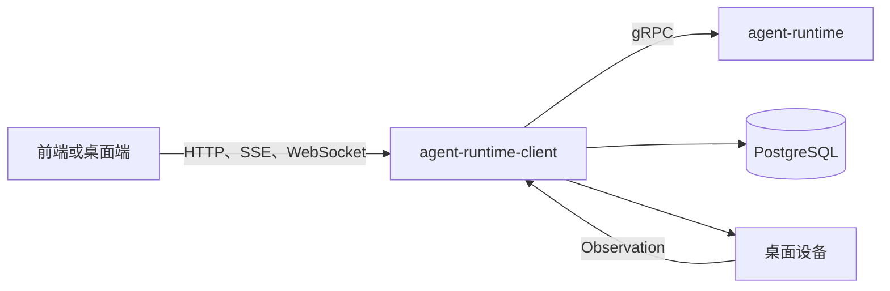

# Agent Runtime Client 代码指南

[English](../en/README.md) | [简体中文](README.md)

本指南说明 `agent-runtime-client` 每个主要部分的用途，并提供理解和修改代码时的实际阅读顺序。目标读者是需要先理解系统、再开始开发或排查问题的贡献者。

## 这个仓库究竟是什么

虽然历史名称中带有 `client`，但 `agent-runtime-client` 并不是客户端 SDK。它是 Athena 的服务端控制面和公共 HTTP API，负责身份、配置、持久状态、治理、设备协调，以及连接 `agent-runtime` 的边界。



最简洁的理解模型是：

- `api`：把传输层请求转换成应用用例。
- `application`：编排完整业务用例。
- `domain`：定义业务语义和依赖端口。
- `infra`：使用 PostgreSQL、gRPC、文件和外部进程实现端口。
- `boot`：构造对象图，并管理后台服务生命周期。

## 推荐阅读路径

### 新贡献者

1. [架构、启动与配置](01-architecture-startup-and-configuration.md)
2. [HTTP API、身份与安全](02-http-api-identity-and-security.md)
3. [资源、领域模型与持久化](03-resources-domain-and-persistence.md)
4. [Runtime 执行、流式响应与设备控制](04-runtime-execution-and-device-control.md)
5. 跟踪 import 时使用[包参考](package-reference.md)。

### 排查 Runtime 请求

1. 从 `api/http/handler/runtime` 开始。
2. 继续进入 `application/service/runtime`。
3. 查看 `domain/srv/runtime` 和 `domain/irepository/runtime`。
4. 最后检查 `infra/runtime` 的 gRPC 与 Stream 映射。
5. 如果产生了 Action，继续进入 `application/service/control`。

### 开发控制面资源

1. 阅读[资源、领域模型与持久化](03-resources-domain-and-persistence.md)。
2. 找到该资源对应的 Handler、DTO、Assembler、Service、Entity、Port、PO、Converter 和 Repository。
3. 使用现有资源作为纵向切片模板。

### 开发受治理的 Agent OS 能力

1. [委派、Goal 与调度](05-delegation-goals-and-scheduling.md)
2. [经验、学习、部署与知识](06-experience-learning-deployment-and-knowledge.md)
3. [运维、工作区与集成](07-operations-workspaces-and-integrations.md)
4. [测试与扩展指南](08-testing-and-extension-guide.md)

## 章节索引

| 章节 | 内容 |
| --- | --- |
| [01](01-architecture-startup-and-configuration.md) | 进程生命周期、依赖方向、配置和 Boot 装配 |
| [02](02-http-api-identity-and-security.md) | Gin 路由、中间件、认证、错误响应、SSE 与 WebSocket 边界 |
| [03](03-resources-domain-and-persistence.md) | CRUD 资源、DDD 分层、模型/Key 隔离、Repository 与迁移 |
| [04](04-runtime-execution-and-device-control.md) | 请求补全、gRPC Stream、Action/Observation 循环、聊天记录与媒体任务 |
| [05](05-delegation-goals-and-scheduling.md) | 持久委派、动态 Specialist、长期 Goal、Checkpoint 与定时工作 |
| [06](06-experience-learning-deployment-and-knowledge.md) | 脱敏经验、评测、受治理进化、不可变 Build 与证据知识 |
| [07](07-operations-workspaces-and-integrations.md) | Readiness、备份恢复、本地工作区、配置、渠道、回调与外部适配 |
| [08](08-testing-and-extension-guide.md) | 测试策略、安全扩展、排查路径与架构护栏 |
| [包参考](package-reference.md) | 仓库内每个 Go Package 目录的用途 |

## 依赖规则

预期的编译期依赖方向是：

```text
api -> application -> domain <- infra
                         ^
                         |
                        boot
```

`domain` 不应 import Gin、GORM、生成的 gRPC Client 或操作系统适配器。`boot` 是 Composition Root，因此允许了解所有具体实现。

## 术语

| 术语 | 在本仓库中的含义 |
| --- | --- |
| Runtime Client | 当前控制面服务，不是用户 SDK |
| Runtime | 独立的 `agent-runtime` 执行引擎 |
| Action | 请求设备能力改变外部世界的类型化指令 |
| Observation | 设备执行 Action 后返回的证据 |
| Experience | 从已完成任务提取的脱敏、不可变证据 |
| Candidate | 未经评测和治理前不能执行的候选方案 |
| Build | 由已批准 Runtime Artifact 组成的不可变集合 |
| RunManifest | 一次执行实际使用的 Artifact 与 Policy 身份清单 |
| Goal | 能跨越进程和前端重启的持久任务图 |

## 如何维护本指南

新增顶层 Package 或应用子系统时：

1. 在[包参考](package-reference.md)中加入它。
2. 同时更新中英文对应章节。
3. 说明职责和不变量，不要只罗列接口名称。
4. 详细 Schema 应链接现有协议/设计文档，避免复制后产生漂移。
