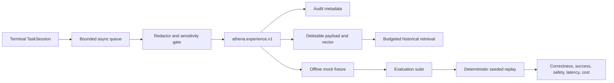

# Experience and Offline Evaluation

[English](experience-evaluation.md) | [Simplified Chinese](experience-evaluation.zh-CN.md)

Athena v0.3 introduces a bounded learning foundation. It records sanitized
task outcomes as historical evidence and converts selected records into
deterministic offline regression fixtures. It does not train models, rewrite
prompts, change routing policy, or execute production actions automatically.

## Safety boundary

The write path is deliberately ordered as:

```text
terminal task event
  -> ownership and preference check
  -> deterministic redaction
  -> sensitivity classification
  -> sanitized Experience validation
  -> separate metadata/payload persistence
```

Experience payloads must not contain credentials, API tokens, cookies, raw
DOM, screenshots, attachment bytes, payment data, identity documents, or
private model reasoning. Redaction audit rows contain only a category, field
path, and SHA-256 digest. The original value is never written to PostgreSQL.

Payload content is physically separate from immutable audit references. User
deletion removes the payload, vector, search text, redaction rows, and failure
detail while retaining a tombstone and event references for accountability.
The hourly retention worker applies the same deletion behavior to expired
records.

## Data flow



Terminal task notifications are non-blocking. A periodic database scan
recovers dropped notifications and unfinished work after restart. Creation is
idempotent by `task_id`, so a recovered task cannot produce duplicate records.

## Retrieval semantics

Retrieval combines structured filters, keyword matching, and a deterministic
local vector score. Every request is bounded by maximum results, token budget,
duration, and sensitivity. Returned hits are always marked
`historical_only=true`.

Historical context is untrusted, read-only reference material. Current World
State and fresh observations always take precedence. Athena v0.3 does not
inject retrieved records into production planning by default.

## Failure taxonomy

Rule-first classification covers intent, routing, planning, model,
capability-selection, argument, policy, device-offline, runtime, perception,
verification, environment-drift, and user-interruption failures. Each result
contains a rule identifier, sanitized summary, confidence, and evidence IDs.

## Offline evaluation

Only simulators containing `.mock.` or ending in `.simulation` are accepted.
Evaluation cannot reach Launcher, browsers, devices, user accounts, or public
network providers. A suite run uses immutable fixture snapshots and an
explicit seed, producing repeatable per-fixture results and aggregate metrics.

## API

All paths below are mounted under `server.public_prefix` and require login.

| Method | Path | Purpose |
| --- | --- | --- |
| `GET`, `PUT` | `/experience/preferences` | Read/update learning, retention, and sensitivity controls |
| `GET` | `/experience` | List the current user's records |
| `GET`, `DELETE` | `/experience/:id` | Read or delete a user-owned payload |
| `POST` | `/experience/search` | Budgeted historical retrieval |
| `GET` | `/experience/stats` | User statistics; administrators may request `scope=all` |
| `POST` | `/experience/:id/fixture` | Create an immutable offline fixture |
| `GET` | `/evaluation/fixtures` | List fixtures |
| `POST`, `GET` | `/evaluation/suites` | Create/list suites |
| `POST` | `/evaluation/suites/:id/runs` | Execute deterministic replay |
| `GET` | `/evaluation/runs` | List runs |
| `GET` | `/evaluation/runs/:id/results` | Read per-fixture results |

The canonical contract is published by
[`athena-protocol`](https://github.com/good-fish-man/athena-protocol) as
`athena.experience.v1`.

## Operational telemetry

`experience.generate`, `experience.retrieve`, and `evaluation.run` spans log
start, completion, elapsed time, and source-aware error chains. HTTP responses
continue to return the request Trace ID so one operation can be followed across
API, repository, runtime, and worker logs.

