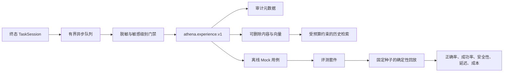

# 经验与离线评测

[English](experience-evaluation.md) | [简体中文](experience-evaluation.zh-CN.md)

Athena v0.3 引入了一套有边界的学习基础设施。系统将任务结果保存为经过脱敏的历史证据，并允许用户把选中的经验转换成确定性离线回归用例。该版本不会自动训练模型、改写提示词、更换路由策略，也不会自动执行生产动作。

## 安全边界

写入顺序被固定为：

```text
任务进入终态
  -> 校验用户归属与学习偏好
  -> 执行确定性脱敏
  -> 计算敏感级别
  -> 校验脱敏后的 Experience
  -> 分离保存审计元数据与可删除内容
```

经验内容不得包含凭据、API Token、Cookie、原始 DOM、截图、附件字节、支付信息、身份证件或模型私有推理。脱敏审计表只保存类别、字段路径和 SHA-256 摘要，原始值不会写入 PostgreSQL。

经验内容与不可变审计引用物理分离。用户删除经验时，系统会删除内容、向量、搜索文本、脱敏记录和失败详情，只保留删除标记与事件引用用于问责。每小时运行的保留策略清理器也采用相同语义。

## 数据流



终态通知不会阻塞任务请求。后台扫描会在突发流量丢失队列通知或服务重启后恢复任务。经验以 `task_id` 幂等创建，同一任务不会生成重复记录。

## 检索语义

检索同时使用结构化过滤、关键词匹配和确定性本地向量分数。每次请求都限制最大结果数、Token、耗时和敏感级别，所有返回项都标记为 `historical_only=true`。

历史经验是不可信、只读的参考资料；当前 World State 与最新 Observation 始终拥有更高优先级。Athena v0.3 默认不会把历史经验自动注入生产规划。

## 失败分类

规则优先的分类器覆盖意图、路由、规划、模型、能力选择、参数、策略、设备离线、运行时、感知、验证、环境漂移和用户中断。分类结果包含规则 ID、脱敏摘要、置信度和证据 ID。

## 离线评测

只接受名称中包含 `.mock.` 或以 `.simulation` 结尾的模拟器。评测不能访问 Launcher、浏览器、设备、用户账号或公网服务。套件使用不可变快照和显式随机种子执行，生成可重复的单用例结果与聚合指标。

## API

以下接口挂载在 `server.public_prefix` 下，并且都需要登录：

| 方法 | 路径 | 用途 |
| --- | --- | --- |
| `GET`、`PUT` | `/experience/preferences` | 读取/修改学习、保留与敏感级别控制 |
| `GET` | `/experience` | 查询当前用户的经验 |
| `GET`、`DELETE` | `/experience/:id` | 读取或删除当前用户的经验内容 |
| `POST` | `/experience/search` | 受预算约束的历史检索 |
| `GET` | `/experience/stats` | 用户统计；管理员可使用 `scope=all` |
| `POST` | `/experience/:id/fixture` | 创建不可变离线用例 |
| `GET` | `/evaluation/fixtures` | 查询用例 |
| `POST`、`GET` | `/evaluation/suites` | 创建/查询套件 |
| `POST` | `/evaluation/suites/:id/runs` | 执行确定性回放 |
| `GET` | `/evaluation/runs` | 查询运行记录 |
| `GET` | `/evaluation/runs/:id/results` | 查询单用例结果 |

规范契约由 [`athena-protocol`](https://github.com/good-fish-man/athena-protocol) 以 `athena.experience.v1` 发布。

## 可观测性

`experience.generate`、`experience.retrieve` 与 `evaluation.run` Span 会记录开始、结束、耗时和带源码位置的错误链。HTTP 响应继续返回 Trace ID，可以沿 API、Repository、Runtime 和后台 Worker 日志追踪一次操作。

